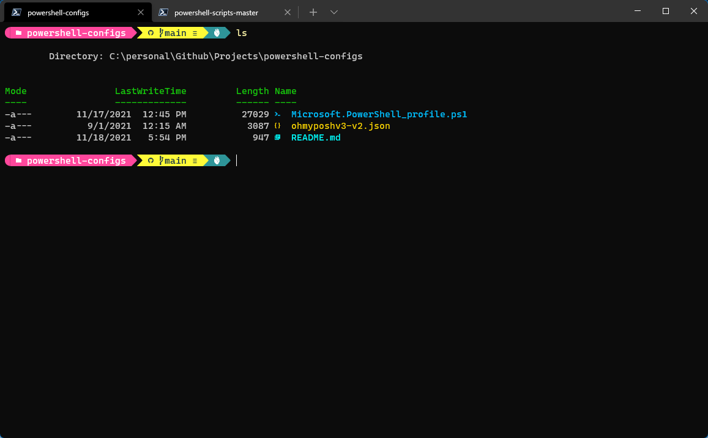

# Powershell Configurations
This repository contains PowerShell custom configurations/themes and profile settings for future references. 

This was inspired from the great [Scott Hanselman](https://www.hanselman.com/blog/my-ultimate-powershell-prompt-with-oh-my-posh-and-the-windows-terminal)



## HOW TO USE

Fire up PowerShell!

Clone this Repo

```bash
git clone https://github.com/rishigohil/powershell-configurations.git
```

Get [OH MY POSH](https://ohmyposh.dev/) for this customization (They have got impressive themes!)

```powershell
winget install JanDeDobbeleer.OhMyPosh
# restart shell to reload PATH
```

### Setting up the PowerShell Profile

#### Option 1: Use the Complete Profile (Recommended)

If you don't have an existing PowerShell profile or want to replace it completely:

1. Copy the `Microsoft.PowerShell_profile.ps1` from this repo to your PowerShell profile location:

   ```powershell
   # Find your profile path
   $PROFILE
   
   # Copy the profile file
   Copy-Item "Microsoft.PowerShell_profile.ps1" $PROFILE -Force
   ```

#### Option 2: Merge with Existing Profile

If you have an existing PowerShell profile, add these essential components:

1. **Required Modules** - Add to the top of your profile:

   ```powershell
   Import-Module PSReadLine
   Import-Module -Name Terminal-Icons
   Import-Module oh-my-posh
   ```

2. **Oh My Posh Initialization** - Add this line (update the path to your themes folder):

   ```powershell
   oh-my-posh --init --shell pwsh --config "C:/path/to/your/themes/ohmyposhv3-v2.json" | Invoke-Expression
   ```

3. **Theme Selector Function** - Copy the theme selector function from `PoshThemePicker.ps1` to your profile

4. **Optional Enhancements** - Copy any PSReadLine key handlers or other customizations you want from the provided profile

### Reload Your Profile

After making changes, restart your PowerShell or reload your profile:

```powershell
. $PROFILE
```

## Theme Selector

This configuration now includes a convenient theme selector!

### Using the Theme Selector

Simply type `theme` in your PowerShell session to open the interactive theme selector:

```powershell
theme
```

The theme selector will:

- Display all available Oh My Posh themes from the `themes/` folder
- Allow you to preview and select any theme
- Let you choose the default theme option
- Apply the selected theme immediately

### Adding New Themes

To add new Oh My Posh themes:

1. Download or create your `.omp.json` theme file
2. Place the theme file in the `themes/` folder
3. The theme will automatically appear in the selector the next time you run `theme`

